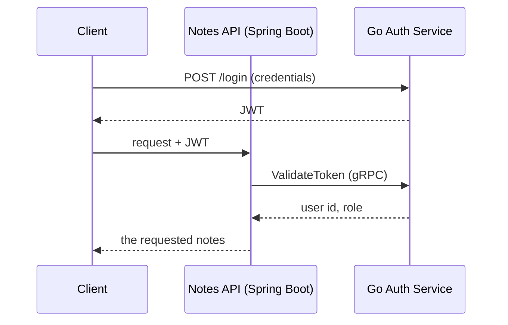

# Go Auth Service


A JWT identity service in Go, and the auth half of a two-service system. This service handles who you are; a [Spring Boot service](https://github.com/AshrafAhmed9/springboot-resource-api) handles what you own, and checks every request against this one over gRPC.

Most auth demos stop at "issue a JWT, check the signature." The part that's actually hard is what happens after: how do you let a session last a week without a 7-day token sitting around as a stolen-and-reused liability, and how do you revoke something that's cryptographically designed not to need a database lookup? Those two problems are what this service is built around.

**31 tests · Postgres + SQLite · gRPC + REST**

## The core idea

Access tokens are short-lived JWTs, 15 minutes, verified by recomputing a signature with no database hit required. That's what makes them fast, and it's also why they can't be revoked: the signature is valid until it expires, full stop. So staying logged in for a week runs through a second credential, a refresh token, that works the opposite way: opaque, stored, and checked against the database on every use, because a credential you can revoke is one you have to look up.

The refresh token is where the interesting engineering lives. It's single-use: every refresh consumes the old one and issues a new one. That single property turns theft from invisible into detectable: if a refresh token is ever presented twice, someone other than the real user has a copy, and there's no way to tell which presentation is legitimate. So the response isn't to guess. It's to revoke every session that user has and force a real login.

Making that check reliable took getting one detail right. The obvious implementation reads the token's row, checks if it's already revoked, and if not, revokes it: three steps, two of them separated in time. Two simultaneous replays of the same stolen token can both pass the check before either commits the write, and both succeed. The fix is to fold the check into the write itself:

```go
result := h.db.Model(&RefreshToken{}).
    Where("id = ? AND revoked_at IS NULL", rt.ID).
    Update("revoked_at", time.Now())

if result.RowsAffected == 0 {
    h.revokeAllSessions(rt.UserID)
    // reuse detected, every session for this user dies here
}
```

One atomic UPDATE. The database's row lock decides who wins a simultaneous race, and `RowsAffected == 0` isn't just "I lost a race," it's the exact definition of reuse. The concurrency fix and the security check turned out to be the same line.

## How the two services fit together



Login is the only time the client talks to this service directly. Every request after that goes through Java, which calls this service over gRPC on the client's behalf.

Both sides share one `.proto` file, so the contract is enforced by the compiler, not by hope: rename a field here and the Java build fails before it ever reaches production. And the two services made opposite calls about what to do when a dependency dies, which is one of the better things to talk through: this service's rate limiter fails *open* to an in-memory fallback if Redis goes down, because a locked-out login system is worse than a temporarily weaker one. The Java service fails *closed*, 503, refuse the request, if it can't reach this service, because serving data it couldn't authorize is worse than an error. Same category of problem, opposite answer, because the cost of being wrong is different each time.

## What's inside

**Tokens.** HS256-signed JWTs with a `jti` claim for targeted revocation. `parseToken` explicitly asserts the signing method is HMAC before trusting anything else in the token, which is what blocks the classic `alg: none` forgery, where an attacker edits the header to claim no signature is needed at all. Refresh tokens are 32 random bytes from `crypto/rand`, stored as a SHA-256 hash, never the raw value, so a database leak yields nothing usable at `/refresh`.

**Revocation.** Logging out can't un-sign a JWT, so it blacklists the token's `jti` in Redis instead, with the blacklist entry's TTL set to exactly the token's remaining lifetime. It expires itself the moment it would stop mattering: no cleanup job, no unbounded growth.

**Rate limiting.** `/login` is capped per IP via a Redis-backed fixed-window counter, because it's the one endpoint where credentials can be guessed, and because bcrypt at cost 12 makes it the most CPU-expensive endpoint in the service. If Redis is unreachable, it degrades to an in-process counter rather than either locking everyone out or letting every request through.

**gRPC.** One RPC, `ValidateToken`, and the detail that makes the whole cross-service design hold together: an expired or revoked token is never a gRPC *error*. It's a normal, successful response saying `valid: false`. Only an actually unreachable service looks like a transport error, which is what lets the Java side's circuit breaker count real failures without tripping over ordinary expired tokens.

**Storage.** GORM behind a driver switch: Postgres in Docker, SQLite for local runs and for the test suite, which is why 31 tests finish in about two seconds with zero infrastructure. Postgres gets versioned SQL migrations; SQLite gets `AutoMigrate`, since a throwaway local database doesn't need migration discipline.

## Running it

```bash
git clone https://github.com/AshrafAhmed9/go-auth-service.git
cd go-auth-service
cp .env.example .env   # set JWT_SECRET to 32+ random characters
make run
```

A seeded admin account (`admin@app.com` / `admin123`) exists on first run so there's something to log in with immediately. With Docker instead:

```bash
docker compose up --build   # Postgres + Redis + the API
```

To see it working alongside the Java service (login, cross-service note creation, killing the auth service mid-session to watch the notes API fail closed, then recovering automatically), clone `springboot-resource-api` as a sibling folder and run `./demo.sh --reset`. It narrates every step.

```bash
make test                # 31 tests, SQLite in-memory + miniredis, no infra
go test ./... -race -cover
```

## API

| Method | Path | Auth | Rate limited | Purpose |
|---|---|---|---|---|
| POST | `/signup` | No | No | Register a user (role is always `user`, server-assigned) |
| POST | `/login` | No | Per-IP | Get an access + refresh token pair |
| POST | `/refresh` | No | No | Rotate a refresh token for a new pair |
| POST | `/logout` | JWT | No | Blacklist the access token, revoke all refresh tokens |
| GET | `/health` | No | No | Liveness check |

gRPC on `:9090` exposes `AuthService.ValidateToken(token) → (valid, user_id, email, role, error)`, the one thing the Notes API calls, on every authenticated request.

## Design decisions and their honest costs

15-minute access tokens plus 7-day refresh tokens with rotation: this bounds a stolen access token's blast radius to 15 minutes without forcing a password re-entry every quarter hour, and rotation makes refresh-token theft self-reporting instead of silent.

Redis rate limiting with an in-memory fallback: a shared counter is what makes "5 per minute" actually mean 5 per minute across multiple instances. Without sharing it, the limit weakens every time you scale out. The honest cost is that it's a fixed window, so a burst straddling a window boundary can let through up to double the stated limit. A token bucket would close that gap at the cost of more state per key.

Opaque refresh tokens hashed with plain SHA-256, not bcrypt: bcrypt's slowness defends against guessing a low-entropy human password. A refresh token is 256 bits of CSPRNG output, nothing to guess, so a slow hash would only add latency with no security benefit.

Blacklist by `jti`, not the full token: same revocation power, a 36-character Redis key instead of a ~300-character one.

## Known limitations

No MFA, no account lockout beyond per-IP rate limiting (a deliberate omission, since lockout is itself a denial-of-service vector against the account it's meant to protect), no secret rotation, and a single Redis instance as a point of failure for revocation and rate limiting both. None of these are hidden; they're the corners a two-service portfolio project reasonably cuts, not gaps I didn't notice.

## Project structure

```
main.go              HTTP + gRPC server startup, route registration
config.go            Environment variable loading and validation
models.go            User and RefreshToken structs
store.go             DB connection (Postgres/SQLite), admin seeding
jwt.go                JWT generation + parsing (HS256, jti)
auth.go               Signup, Login, Refresh, Logout
middleware.go          requireAuth, the guard on protected routes
ratelimit.go          Per-IP rate limiting with in-memory fallback
redis.go              Redis client (blacklist + rate-limit counter)
grpc.go               gRPC ValidateToken implementation
*_test.go             31 tests, named after the file each one covers
demo.sh               Narrated two-service demo (needs the Java repo alongside)

proto/
├── auth.proto        Protobuf service definition (shared verbatim with the Java repo)
└── authpb/           Generated Go stubs
migrations/           Versioned SQL migrations (Postgres)
Dockerfile
docker-compose.yml    Postgres + Redis + API
.github/workflows/ci.yml
```

## The other half

The [Spring Boot Notes API](https://github.com/AshrafAhmed9/springboot-resource-api) is what actually calls `ValidateToken`: a token-hash-keyed cache, a circuit breaker, and the fail-closed side of the design decision described above. Its README covers the k6 numbers for the combined path.
